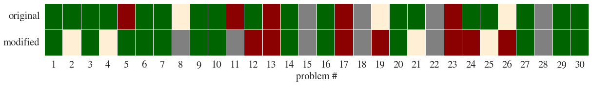
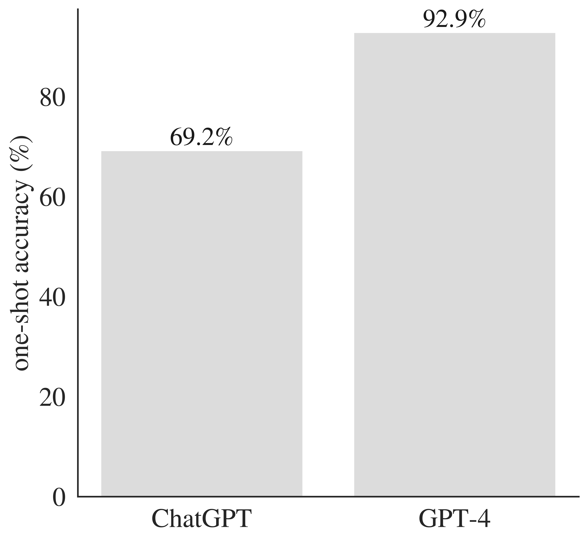

# GPT-4 & ChatGPT – Project Euler
Exploration of the performance of [GPT-4](https://openai.com/research/gpt-4) and [ChatGPT](https://openai.com/blog/chatgpt) (both OpenAI) on [Project Euler](https://projecteuler.net/), a set of problems blending mathematical reasoning and programming.

## Results

Here, I provided the text and equations (where necessary using LaTeX formatting, which [ChatGPT is able to parse](https://twitter.com/sioum/status/1599382056337014787)) to represent Project Euler problems 1-30 as a prompt. For consistency, in all instances, I added a sentence requesting the solution in the form of a Python script. After evaluating this script against known, ground-truth baselines, I then prompted ChatGPT to try again, or moved onto the next problem.

I then modified the problems such that the concept and structure of the problem remained the same, but the particularities were changed (such as [this example](https://github.com/mccaffary/ChatGPT-Project-Euler/blob/main/src/example_modified_question.txt)); this yielded some more interesting results (see Comments).

> Here, green denotes ChatGPT finding the correct solution at first ask; orange at second ask; red means it did not find the solution. Grey means I [couldn't find a good way of representing the problem](https://github.com/mccaffary/ChatGPT-Project-Euler/blob/main/src/discounted_problems.txt), usually because it required understanding an image.

| Problem # | Ground-truth solution | ChatGPT solutions | GPT-4 solutions |
|-----------|-----------------------|-------------------| ----------------|
| [Problem 1](https://projecteuler.net/problem=1) | [problem 1 solution](https://github.com/mccaffary/ChatGPT-Project-Euler/blob/main/src/ground_truth/problem_1_ground_truth.py) | [first attempt](https://github.com/mccaffary/ChatGPT-Project-Euler/blob/main/src/chat_gpt/problem_1_gpt_first_attempt.py)                  | [first attempt](https://github.com/mccaffary/GPT-4-ChatGPT-Project-Euler/blob/main/src/GPT-4/problem_1.py) |
| [Problem 2](https://projecteuler.net/problem=2) | [problem 2 solution](https://github.com/mccaffary/ChatGPT-Project-Euler/blob/main/src/ground_truth/problem_2_ground_truth.py)                       | [first attempt](https://github.com/mccaffary/ChatGPT-Project-Euler/blob/main/src/chat_gpt/problem_2_gpt_first_attempt.py)                  | [first attempt](https://github.com/mccaffary/GPT-4-ChatGPT-Project-Euler/blob/main/src/GPT-4/problem_2.py) |
| [Problem 3](https://projecteuler.net/problem=3) | [problem 3 solution](https://github.com/mccaffary/ChatGPT-Project-Euler/blob/main/src/ground_truth/problem_3_ground_truth.py)                      | [first attempt](https://github.com/mccaffary/ChatGPT-Project-Euler/blob/main/src/chat_gpt/problem_3_gpt_first_attempt.py)                  | [first attempt](https://github.com/mccaffary/GPT-4-ChatGPT-Project-Euler/blob/main/src/GPT-4/problem_3.py) |
| [Problem 4](https://projecteuler.net/problem=4) | [problem 4 solution](https://github.com/mccaffary/ChatGPT-Project-Euler/blob/main/src/ground_truth/problem_4_ground_truth.py)                      | [first attempt](https://github.com/mccaffary/ChatGPT-Project-Euler/blob/main/src/chat_gpt/problem_4_gpt_first_attempt.py)                  | [first attempt](https://github.com/mccaffary/GPT-4-ChatGPT-Project-Euler/blob/main/src/GPT-4/problem_4.py) |
| [Problem 5](https://projecteuler.net/problem=5) | [problem 5 solution](https://github.com/mccaffary/ChatGPT-Project-Euler/blob/main/src/ground_truth/problem_5_ground_truth.py)                      | [first attempt](https://github.com/mccaffary/ChatGPT-Project-Euler/blob/main/src/chat_gpt/problem_5_gpt_first_attempt.py) - [second attempt](https://github.com/mccaffary/ChatGPT-Project-Euler/blob/main/src/chat_gpt/problem_5_gpt_third_attempt.py)                  | [first attempt](https://github.com/mccaffary/GPT-4-ChatGPT-Project-Euler/blob/main/src/GPT-4/problem_5.py) |
| [Problem 6](https://projecteuler.net/problem=6) | [problem 6 solution](https://github.com/mccaffary/ChatGPT-Project-Euler/blob/main/src/ground_truth/problem_6_ground_truth.py)                      | [first attempt](https://github.com/mccaffary/ChatGPT-Project-Euler/blob/main/src/chat_gpt/problem_6_gpt_first_attempt.py)                  | [first attempt](https://github.com/mccaffary/GPT-4-ChatGPT-Project-Euler/blob/main/src/GPT-4/problem_6.py) |
| [Problem 7](https://projecteuler.net/problem=7) | [problem 7 solution](https://github.com/mccaffary/ChatGPT-Project-Euler/blob/main/src/ground_truth/problem_7_ground_truth.py)                      | [first attempt](https://github.com/mccaffary/ChatGPT-Project-Euler/blob/main/src/chat_gpt/problem_7_gpt_first_attempt.py)                  | [first attempt](https://github.com/mccaffary/GPT-4-ChatGPT-Project-Euler/blob/main/src/GPT-4/problem_7.py) |
| [Problem 8](https://projecteuler.net/problem=8) | [problem 8 solution](https://github.com/mccaffary/ChatGPT-Project-Euler/blob/main/src/ground_truth/problem_8_ground_truth.py)                      | [first attempt](https://github.com/mccaffary/ChatGPT-Project-Euler/blob/main/src/chat_gpt/problem_8_gpt_first_attempt.py) - [second attempt](https://github.com/mccaffary/ChatGPT-Project-Euler/blob/main/src/chat_gpt/problem_8_gpt_second_attempt.py)                  | [first attempt](https://github.com/mccaffary/GPT-4-ChatGPT-Project-Euler/blob/main/src/GPT-4/problem_8.py) |
| [Problem 9](https://projecteuler.net/problem=9) | [problem 9 solution](https://github.com/mccaffary/ChatGPT-Project-Euler/blob/main/src/ground_truth/problem_9_ground_truth.py)                      | [first attempt](https://github.com/mccaffary/ChatGPT-Project-Euler/blob/main/src/chat_gpt/problem_9_gpt_first_attempt.py)                  | [first attempt](https://github.com/mccaffary/GPT-4-ChatGPT-Project-Euler/blob/main/src/GPT-4/problem_9.py) |
| [Problem 10](https://projecteuler.net/problem=10) | [problem 10 solution](https://github.com/mccaffary/ChatGPT-Project-Euler/blob/main/src/ground_truth/problem_10_ground_truth.py)                      | [first attempt](https://github.com/mccaffary/ChatGPT-Project-Euler/blob/main/src/chat_gpt/problem_10_gpt_first_attempt.py)                  | [first attempt](https://github.com/mccaffary/GPT-4-ChatGPT-Project-Euler/blob/main/src/GPT-4/problem_10.py) |
| [Problem 11](https://projecteuler.net/problem=11) | [problem 11 solution](https://github.com/mccaffary/ChatGPT-Project-Euler/blob/main/src/ground_truth/problem_11_ground_truth.py)                      | [first attempt](https://github.com/mccaffary/ChatGPT-Project-Euler/blob/main/src/chat_gpt/problem_11_gpt_first_attempt.py) - [second attempt](https://github.com/mccaffary/ChatGPT-Project-Euler/blob/main/src/chat_gpt/problem_11_gpt_second_attempt.py)                  | [first attempt](https://github.com/mccaffary/GPT-4-ChatGPT-Project-Euler/blob/main/src/GPT-4/problem_11.py) - [second attempt](https://github.com/mccaffary/GPT-4-ChatGPT-Project-Euler/blob/main/src/GPT-4/problem_11_second_attempt.py) |
| [Problem 12](https://projecteuler.net/problem=12) | [problem 12 solution](https://github.com/mccaffary/ChatGPT-Project-Euler/blob/main/src/ground_truth/problem_12_ground_truth.py)                      | [first attempt](https://github.com/mccaffary/ChatGPT-Project-Euler/blob/main/src/chat_gpt/problem_12_gpt_first_attempt.py)                  | [first attempt](https://github.com/mccaffary/GPT-4-ChatGPT-Project-Euler/blob/main/src/GPT-4/problem_12.py) |
| [Problem 13](https://projecteuler.net/problem=13) | [problem 13 solution](https://github.com/mccaffary/ChatGPT-Project-Euler/blob/main/src/ground_truth/problem_13_ground_truth.py)                      | [first attempt](https://github.com/mccaffary/ChatGPT-Project-Euler/blob/main/src/chat_gpt/problem_13_gpt_first_attempt.py) - [second attempt](https://github.com/mccaffary/ChatGPT-Project-Euler/blob/main/src/chat_gpt/problem_13_gpt_second_attempt.py)                  | [first attempt](https://github.com/mccaffary/GPT-4-ChatGPT-Project-Euler/blob/main/src/GPT-4/problem_13.py) - [second attempt](https://github.com/mccaffary/GPT-4-ChatGPT-Project-Euler/blob/main/src/GPT-4/problem_13_second_attempt.py) |
| [Problem 14](https://projecteuler.net/problem=14) | [problem 14 solution](https://github.com/mccaffary/ChatGPT-Project-Euler/blob/main/src/ground_truth/problem_14_ground_truth.py)                      | [first attempt](https://github.com/mccaffary/ChatGPT-Project-Euler/blob/main/src/chat_gpt/problem_14_gpt_first_attempt.py)                  | [first attempt](https://github.com/mccaffary/GPT-4-ChatGPT-Project-Euler/blob/main/src/GPT-4/problem_14.py) |
| [Problem 15](https://projecteuler.net/problem=15) | [problem 15 solution](https://github.com/mccaffary/ChatGPT-Project-Euler/blob/main/src/ground_truth/problem_15_ground_truth.py)                      | n/a                  | n/a |
| [Problem 16](https://projecteuler.net/problem=16) | [problem 16 solution](https://github.com/mccaffary/ChatGPT-Project-Euler/blob/main/src/ground_truth/problem_16_ground_truth.py)                      | [first attempt](https://github.com/mccaffary/ChatGPT-Project-Euler/blob/main/src/chat_gpt/problem_16_gpt_first_attempt.py)                  | [first attempt](https://github.com/mccaffary/GPT-4-ChatGPT-Project-Euler/blob/main/src/GPT-4/problem_16.py) |
| [Problem 17](https://projecteuler.net/problem=17) | [problem 17 solution](https://github.com/mccaffary/ChatGPT-Project-Euler/blob/main/src/ground_truth/problem_17_ground_truth.py)                      | [first attempt](https://github.com/mccaffary/ChatGPT-Project-Euler/blob/main/src/chat_gpt/problem_17_gpt_first_attempt.py) - [second attempt](https://github.com/mccaffary/ChatGPT-Project-Euler/blob/main/src/chat_gpt/problem_17_gpt_second_attempt.py)                  | [first attempt](https://github.com/mccaffary/GPT-4-ChatGPT-Project-Euler/blob/main/src/GPT-4/problem_17.py) |
| [Problem 18](https://projecteuler.net/problem=18) | [problem 18 solution](https://github.com/mccaffary/ChatGPT-Project-Euler/blob/main/src/ground_truth/problem_18_ground_truth.py)                      | n/a                  | [first attempt](https://github.com/mccaffary/GPT-4-ChatGPT-Project-Euler/blob/main/src/GPT-4/problem_18.py) |
| [Problem 19](https://projecteuler.net/problem=19) | [problem 19 solution](https://github.com/mccaffary/ChatGPT-Project-Euler/blob/main/src/ground_truth/problem_19_ground_truth.py)                      | [first attempt](https://github.com/mccaffary/ChatGPT-Project-Euler/blob/main/src/chat_gpt/problem_19_gpt_first_attempt.py) - [second attempt](https://github.com/mccaffary/ChatGPT-Project-Euler/blob/main/src/chat_gpt/problem_19_gpt_second_attempt.py)                  | [first attempt](https://github.com/mccaffary/GPT-4-ChatGPT-Project-Euler/blob/main/src/GPT-4/problem_19.py) |
| [Problem 20](https://projecteuler.net/problem=20) | [problem 20 solution](https://github.com/mccaffary/ChatGPT-Project-Euler/blob/main/src/ground_truth/problem_20_ground_truth.py)                      | [first attempt](https://github.com/mccaffary/ChatGPT-Project-Euler/blob/main/src/chat_gpt/problem_20_gpt_first_attempt.py)                  | [first attempt](https://github.com/mccaffary/GPT-4-ChatGPT-Project-Euler/blob/main/src/GPT-4/problem_20.py) |
| [Problem 21](https://projecteuler.net/problem=21) | [problem 21 solution](https://github.com/mccaffary/ChatGPT-Project-Euler/blob/main/src/ground_truth/problem_21_ground_truth.py)                      | [first attempt](https://github.com/mccaffary/ChatGPT-Project-Euler/blob/main/src/chat_gpt/problem_21_gpt_first_attempt.py)                  | [first attempt](https://github.com/mccaffary/GPT-4-ChatGPT-Project-Euler/blob/main/src/GPT-4/problem_21.py) | 
| [Problem 22](https://projecteuler.net/problem=22) | [problem 22 solution](https://github.com/mccaffary/ChatGPT-Project-Euler/blob/main/src/ground_truth/problem_22_ground_truth.py)                      | n/a                  | n/a |
| [Problem 23](https://projecteuler.net/problem=23) | [problem 23 solution](https://github.com/mccaffary/ChatGPT-Project-Euler/blob/main/src/ground_truth/problem_23_ground_truth.py)                      | [first attempt](https://github.com/mccaffary/ChatGPT-Project-Euler/blob/main/src/chat_gpt/problem_23_gpt_first_attempt.py) - [second attempt](https://github.com/mccaffary/ChatGPT-Project-Euler/blob/main/src/chat_gpt/problem_23_gpt_second_attempt.py)                  | [first attempt](https://github.com/mccaffary/GPT-4-ChatGPT-Project-Euler/blob/main/src/GPT-4/problem_23.py) |
| [Problem 24](https://projecteuler.net/problem=24) | [problem 24 solution](https://github.com/mccaffary/ChatGPT-Project-Euler/blob/main/src/ground_truth/problem_24_ground_truth.py)                      | [first attempt](https://github.com/mccaffary/ChatGPT-Project-Euler/blob/main/src/chat_gpt/problem_24_gpt_first_attempt.py)                  | [first attempt](https://github.com/mccaffary/GPT-4-ChatGPT-Project-Euler/blob/main/src/GPT-4/problem_24.py) | 
| [Problem 25](https://projecteuler.net/problem=25) | [problem 25 solution](https://github.com/mccaffary/ChatGPT-Project-Euler/blob/main/src/ground_truth/problem_25_ground_truth.py)                      | [first attempt](https://github.com/mccaffary/ChatGPT-Project-Euler/blob/main/src/chat_gpt/problem_25_gpt_first_attempt.py)                  | [first attempt](https://github.com/mccaffary/GPT-4-ChatGPT-Project-Euler/blob/main/src/GPT-4/problem_25.py) |
| [Problem 26](https://projecteuler.net/problem=26) | [problem 26 solution](https://github.com/mccaffary/ChatGPT-Project-Euler/blob/main/src/ground_truth/problem_26_ground_truth.py)                      | [first attempt](https://github.com/mccaffary/ChatGPT-Project-Euler/blob/main/src/chat_gpt/problem_26_gpt_first_attempt.py) - [second attempt](https://github.com/mccaffary/ChatGPT-Project-Euler/blob/main/src/chat_gpt/problem_26_gpt_second_attempt.py)                  | [first attempt](https://github.com/mccaffary/GPT-4-ChatGPT-Project-Euler/blob/main/src/GPT-4/problem_26.py) |
| [Problem 27](https://projecteuler.net/problem=27) | [problem 27 solution](https://github.com/mccaffary/ChatGPT-Project-Euler/blob/main/src/ground_truth/problem_27_ground_truth.py)                      | [first attempt](https://github.com/mccaffary/ChatGPT-Project-Euler/blob/main/src/chat_gpt/problem_27_gpt_first_attempt.py)                  | [first attempt](https://github.com/mccaffary/GPT-4-ChatGPT-Project-Euler/blob/main/src/GPT-4/problem_27.py) |
| [Problem 28](https://projecteuler.net/problem=28) | [problem 28 solution](https://github.com/mccaffary/ChatGPT-Project-Euler/blob/main/src/ground_truth/problem_28_ground_truth.py)                      | n/a                  | [first attempt](https://github.com/mccaffary/GPT-4-ChatGPT-Project-Euler/blob/main/src/GPT-4/problem_28.py) |
| [Problem 29](https://projecteuler.net/problem=29) | [problem 29 solution](https://github.com/mccaffary/ChatGPT-Project-Euler/blob/main/src/ground_truth/problem_29_ground_truth.py)                      | [first attempt](https://github.com/mccaffary/ChatGPT-Project-Euler/blob/main/src/chat_gpt/problem_29_gpt_first_attempt.py)                  | [first attempt](https://github.com/mccaffary/GPT-4-ChatGPT-Project-Euler/blob/main/src/GPT-4/problem_29.py) |
| [Problem 30](https://projecteuler.net/problem=30) | [problem 30 solution](https://github.com/mccaffary/ChatGPT-Project-Euler/blob/main/src/ground_truth/problem_30_ground_truth.py)                      | [first attempt](https://github.com/mccaffary/ChatGPT-Project-Euler/blob/main/src/chat_gpt/problem_30_gpt_first_attempt.py)                  | [first attempt](https://github.com/mccaffary/GPT-4-ChatGPT-Project-Euler/blob/main/src/GPT-4/problem_30.py) |

## Comments

### GPT-4

> GPT-4 outperforms ChatGPT in terms of one-shot accuracy across a range of mathematical and programming problems.

ajkhajlkhfjkadhjfkdahkjh

### ChatGPT

Performance was, in my opinion, impressive. ChatGPT did not (obviously) regurgitate code samples from its training dataset (none of the Python scripts generated matched any on Github or Gitlab), and sometimes made attempts to optimise the solution (e.g. using [divide-and-conquer](https://github.com/mccaffary/ChatGPT-Project-Euler/blob/main/src/chat_gpt/problem_19_gpt_second_attempt.py) approaches in [problem 19](https://projecteuler.net/problem=19), or in [problem 6](https://projecteuler.net/problem=6) where it uses: $$\sum_{k=1}^n k=\frac{1}{2} n(n+1)$$ the [expression for triangular numbers](https://github.com/mccaffary/ChatGPT-Project-Euler/blob/main/src/chat_gpt/problem_6_gpt_first_attempt.py), without prompting).

As noted by others, the model struggles with very large numbers, even when they do not appreciably increase the conceptual difficulty of the problem (c.f. [problem 13](https://projecteuler.net/problem=13)).

Finally, the modified problems yielded some insights. In a number of cases, the model generated a Python script that generated the correct answer (for the modified problem), but ChatGPT wrote the numerical answer from the original question. In other cases, it ignored the modified wording entirely, and provided me with a working solution to the original framing of the problem.

